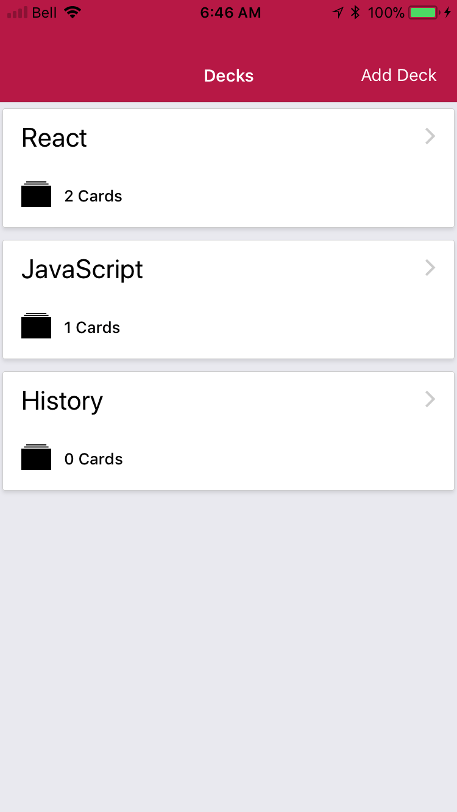

# FlashCards
## Udacity React Final Project #3

## Overview
FlashCards is a React-Native app to help you study. It allows you to easily create thematic decks of flash cards, each with a question and answer and then run a quick quiz on these decks to test your skills. You can view the answer and keep a tally of your progress. At the end of the Quiz a summary of your score will be shown. It has only been tested on iOS.

## Install Instructions
  - clone this repo
  - `yarn install`
  - `yarn start`
  - This app has only been tested on iOS. Let us know your feedback on Android.

## Features:
  - React-Native using Expo CRNA
  - Redux
  - Redux-Form for validation
  - Redux Logger
  - Redux Thunk
  - Native Base for UI
  - React Navigation
  - Local Notifications

## Future Enhancements:
- Splash Screen (Use Expo feature)
- Redux Persist Install
- Settings Page - All Time Stats / Reset
- Delete Deck Logic
- List Quiz Cards
- Remove Quiz Cards
- Google Authentication / Expo
- Share to Expo

This project was bootstrapped with [Create React Native App](https://github.com/react-community/create-react-native-app).
